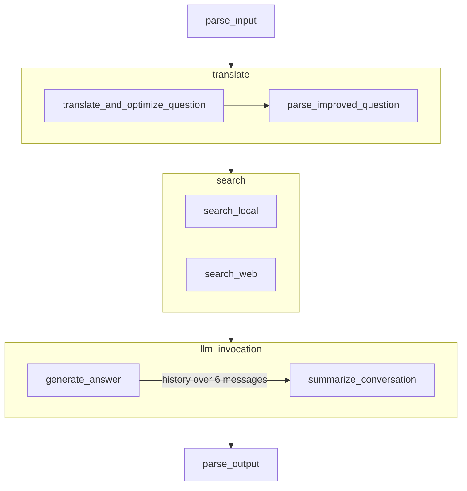

# LaredocMind

Retrieval-augmented conversational assistant for LAREDO, the MLOps platform built by the ISTR research group at the University of Cantabria. LAREDO lets non-expert users build and deploy machine learning pipelines, and it shipped without any documentation: people got stuck looking for information that did not exist. LaredocMind answers questions about the tool by retrieving from a knowledge base written for the purpose, instead of relying on what the model happens to remember.


## How it works

The conversation is modelled as a LangGraph state graph with three subgraphs.



1. Translate and optimise. A lightweight model rewrites the incoming question for retrieval and translates it into English, because retrieval over an English corpus gives better results. The node returns JSON that also carries the detected language, so the final answer comes back in the language the user wrote in. "¿Qué es random forest?" becomes "What is the Random Forest algorithm?".
2. Search. Two retrievers run in parallel against two separate ChromaDB collections: `local_documents`, built from the guides written for LAREDO, and `web_documents`, built from external scikit-learn documentation. The split is deliberate, and so is the weighting: three fragments from the local collection and one from the web collection, because the local corpus is the more trustworthy of the two.
3. Generate and summarise. Gemini answers from the combined context. Once the history passes six messages, a cheaper second model rewrites it into a running summary and the older messages are dropped, so the context window does not fill up as the conversation grows.

Indexing runs before any of that: the guides are split with `MarkdownTextSplitter`, which respects headings, paragraphs and code blocks, at a chunk size of 1000 with an overlap of 200. Embeddings come from `models/text-embedding-004`. Both collections are initialised in parallel with a thread pool.

## Models and parameters

Two models instead of one, for cost and latency: `gemini-2.0-flash` writes the answer, `gemini-2.0-flash-lite` handles the preprocessing and translation. Final production values live in `backend/src/config/config_init.py`.

| Parameter | Value |
| --- | --- |
| Answer model | `gemini-2.0-flash`, temperature 0.2 |
| Preprocessing model | `gemini-2.0-flash-lite`, temperature 0 |
| Top-p | 0.85 |
| Top-k | 40 |
| Max output tokens | 2048 |
| Chunk size and overlap | 1000 and 200 |
| Retrieved fragments | 3 local, 1 web |
| Summarisation threshold | 6 messages |

## Documentation and evaluation

`backend/docs` holds the nine Markdown guides that make up the knowledge base. They were written from scratch for this project, in English, because LAREDO had no documentation at all: a user guide, a functions guide, and reference plus question sets for scikit-learn classification, preprocessing and regression. The external scikit-learn documentation was scraped with Requests and BeautifulSoup, converted with markdownify and cleaned with regular expressions to strip menus, footers and social links.

`backend/src/evaluator` scores answers against a gold set with ROUGE-L and BLEU, plus an LLM-as-a-judge on three criteria rated 1 to 5: context relevance (CR), faithfulness to the retrieved documents (F), and answer relevance (AR).

Each parameter was swept independently with the same battery of questions. Two of the three sweeps, from the thesis:

| Temperature | ROUGE-L | BLEU | CR | F | AR |
| --- | --- | --- | --- | --- | --- |
| 0.00 | 0.39 | 0.32 | 4.0 | 3.9 | 4.1 |
| 0.10 | 0.46 | 0.37 | 4.4 | 4.7 | 4.5 |
| 0.20 | 0.44 | 0.35 | 4.3 | 4.5 | 4.6 |
| 0.60 | 0.39 | 0.28 | 3.5 | 3.6 | 3.6 |

| Chunk size | ROUGE-L | BLEU | CR | F | AR |
| --- | --- | --- | --- | --- | --- |
| 200 | 0.35 | 0.28 | 3.8 | 3.8 | 3.7 |
| 700 | 0.46 | 0.36 | 4.2 | 4.5 | 4.2 |
| 1000 | 0.47 | 0.37 | 4.5 | 4.8 | 4.6 |
| 1500 | 0.38 | 0.34 | 4.2 | 4.5 | 4.5 |

Automatic metrics pointed at temperature 0.10. A human evaluation with two configurations, literal and creative, rated the creative one higher on quality (4.5 against 4.1) and slightly lower on relevance (3.7 against 3.8). The shipped value is 0.2, a compromise between the precision the metrics ask for and the warmth users preferred. Full tables and methodology are in the thesis linked below. In February 2026 the assistant was distributed to a software quality course at the University of Cantabria, where around twenty master's students installed and used it.

## The bit that took longest to find

Answers come back in Markdown, which separates paragraphs with a blank line. Server-Sent Events uses that same double newline to delimit one event from the next, so the frontend was cutting answers in half at every paragraph break. The fix was to stop relying on the protocol default and mark chunk boundaries with an explicit `<END_OF_CHUNK>` token.

## Stack

Backend: Python 3.11, LangChain, LangGraph, ChromaDB, Google Gemini, Ollama for the local-model study, Loguru, LangSmith, Flask with flask-cors, Poetry.

Frontend: React, Tailwind CSS and Vite, encapsulated with Shadow DOM so it can be dropped into any host page without style collisions, published on npm as [`laredocmind`](https://www.npmjs.com/package/laredocmind) under MIT.

## API

| Endpoint | Method | What it does |
| --- | --- | --- |
| `/chatbot/stream` | POST | Answers a question and streams the response with Server-Sent Events |
| `/hello` | GET | Liveness check |

## Repository layout

```
LaredocMind/
├── backend/          Python API, chatbot logic, docs and evaluation
│   ├── docs/         The nine Markdown guides that feed retrieval
│   ├── src/          api, chatbot, config, evaluator, utils
│   └── tests/        Unit tests for the managers
├── frontend/         React widget, published as an npm package
├── run-app.bat       Starts backend and frontend
└── setup_app.bat     Installs dependencies and prepares both environments
```

## Running it locally

Requires Python 3.11 available as `py -3.11`, Node.js LTS, and a Google API key.

```
git clone https://github.com/Gabiz053/LaredocMind.git
cd LaredocMind
copy backend\.env.example backend\.env
setup_app.bat
run-app.bat
```

The frontend serves on port 21000 and the backend on 20000. `backend/README.md` and `frontend/README.md` cover the manual route and the publishing steps.

## Deployment

In production the assistant runs inside the LAREDO Kubernetes cluster: the backend ships as its own Docker image and is deployed as a service separate from the main LAREDO backend, so it can be scaled on its own, with Helm charts parameterised through `values.yaml`. Those manifests belong to the research group's infrastructure and are not part of this repository. The deployment chapter of the thesis describes the setup and shows the assistant running inside LAREDO.

## Status

This repository is the version delivered as a bachelor's thesis in June 2025. Development continues in the main LAREDO repository, [istr-uc/LaredoMLOps](https://github.com/istr-uc/LaredoMLOps), where LaredocMind has been integrated and where I am credited as one of the authors.

## Background

- Bachelor's thesis: Gómez García, G. [Asistente conversacional para la construcción de workflows de IA en la herramienta LAREDO](https://hdl.handle.net/10902/37133). University of Cantabria, June 2025. Supervised by Marta E. Zorrilla Pantaleón and Ricardo Dintén Herrero.
- Conference paper: Martínez, R., Gómez, G., Tirnauca, C., Zorrilla, M. [Propuesta metodológica para el desarrollo de chatbots basados en RAG: un caso de uso real](https://hdl.handle.net/11705/JISBD/2025/80). JISBD 2025.
- Built during a Collaboration Grant from the Spanish Ministry of Education, 2024-2025, with the ISTR group.

## License

MIT. See [LICENSE](LICENSE).
